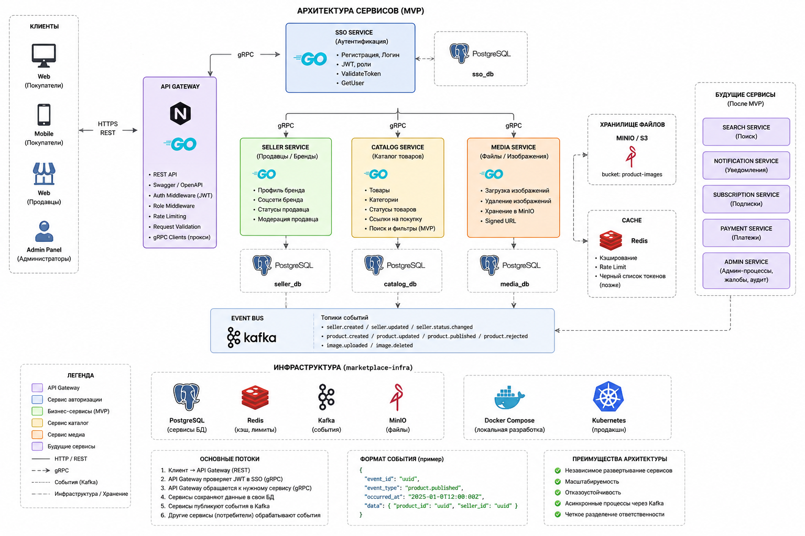

# Eshop architecture

> Status: current project baseline and target MVP architecture.  
> Last reviewed: 2026-07-30.

## Product boundary

Eshop is an online catalogue of brands and products. Sellers manage brand
profiles and product information; visitors discover products and follow
seller-provided purchase links. MVP is a catalogue, not a payment-processing
marketplace.

## Source diagram

The diagram captures the intended MVP topology and the planned post-MVP
extensions. It is not a claim that every component is already deployed.



## Target topology

```text
Web / mobile clients / admin panel
              |
          HTTPS REST
              v
       API Gateway (Go)
              |
             gRPC
    +---------+---------+----------------+
    |                   |                |
  SSO Service     Seller Service   Catalog Service
    |                   |                |
 sso_db          seller_db       catalog_db
                                      |
                                 Media Service
                                      |
                              media_db + MinIO/S3
```

`eshop-api-gateway` is the only public API boundary. It accepts HTTP requests,
validates request-level concerns and authorization, orchestrates gRPC calls,
and returns HTTP responses. It does not own a business database.

### Service responsibilities

| Component | Owns | Does not own |
|---|---|---|
| SSO | users, credentials, JWT, roles, account activity | seller and product data |
| Seller | seller/brand profiles, statuses, social links | user credentials and products |
| Catalog | categories, products, product status, purchase links | image binary storage |
| Media | image upload, deletion, object-storage metadata | product and seller business rules |
| Gateway | REST API, request orchestration, authorization middleware | a shared business database |
| `protos` | versioned gRPC contracts and generated Go code | service implementation |
| `eshop-infra` | local runtime composition and migration execution | service schema definitions |

## Communication and data rules

- Browser and mobile clients call Gateway over HTTPS/REST.
- Gateway and internal services call one another over gRPC.
- Shared protobuf definitions live in `protos` and are released by version tag.
- Every service owns a separate PostgreSQL database and database user.
- Local development uses one PostgreSQL container with multiple databases; this
  is still database-per-service because credentials and schemas are isolated.
- Service-owned migrations remain in each service repository and are mounted
  by `eshop-infra` migrators.
- Request correlation uses `x-request-id` in gRPC metadata and
  `context.Context`; it is not a domain field or protobuf business parameter.

## Runtime stages

### Implemented or substantially implemented

- `sso`: registration, login, JWT issuance, PostgreSQL, gRPC and graceful
  shutdown.
- `eshop-seller-service`: seller CRUD, social links, PostgreSQL migrations,
  gRPC, structured logging, request IDs, graceful shutdown, unit tests and
  PostgreSQL integration tests.
- `eshop-infra`: local PostgreSQL, SSO and Seller Compose services, service
  migrators and Taskfile commands.
- `protos`: SSO and Seller gRPC contracts.

### In progress

- `eshop-api-gateway`: configuration, logger, SSO gRPC client and auth
  use-case exist. The first HTTP auth handler is the current vertical slice.

### Planned but not implemented

- Catalog and Media services;
- Redis, MinIO/S3, Kafka and post-MVP services;
- Gateway routing, JWT middleware, OpenAPI, rate limiting and recovery;
- metrics, tracing, health endpoints and CI.

## Important current gaps

These are implementation gaps, not accepted architectural decisions:

1. SSO's protobuf contract declares `ValidateToken` and `GetUser`, including
   `role` and `is_active`, but the current SSO implementation does not yet
   implement those methods or persist those fields.
2. SSO requires a non-zero `app_id` during `Login`, while the current Gateway
   SSO client does not send one. Before Gateway login is exposed, decide and
   implement a Gateway-owned configured `app_id`; do not expose an internal
   SSO application identifier as a public HTTP API concern.
3. `eshop-infra/.env.example` must remain aligned with all Compose variables.

## Future infrastructure

Redis, Kafka and MinIO are intentional later additions, not early mandatory
dependencies. Add each only when a concrete vertical feature needs it:

- Redis: catalogue caching, rate limiting, token/session revocation if the
  chosen auth design requires it.
- MinIO/S3: product and seller image storage.
- Kafka: durable domain events such as seller approval or product publication;
  consumers include Notification and Analytics services.
